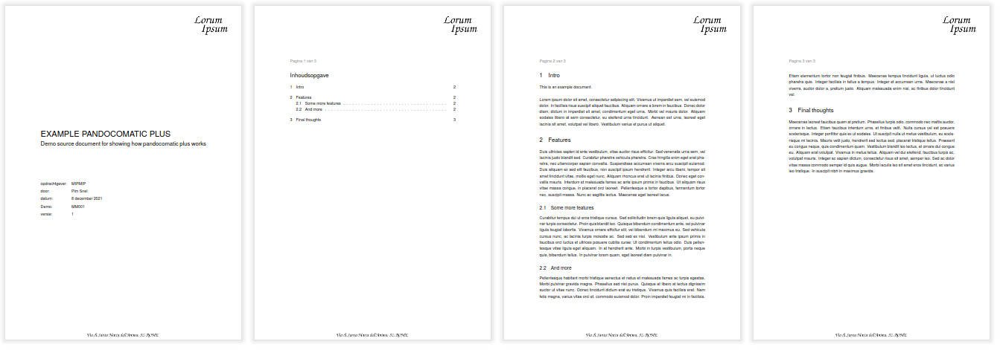

# Docker Pandocomatic Plus

This Docker images has all tools to create beautiful PDF's from markdown files using Pandoc and Latex. Designed to be used with CI pipelines.

Latest version is on https://github.com/linden-project/docker-frontmatter-md-to-pdf

## Includes

- TexLive
- Some extra Tex-fonts
- Pandoc
- Pandocomatic
- Fred

## Example

The [example directory](/example/) contains a setup which creates an [example
PDF](https://raw.githubusercontent.com/linden-project/docker-frontmatter-md-to-pdf/pdf/MM001_Example%20Pandocomatic%20Plus_MIPMIP_1.pdf)

### Integrate in GitHub Actions

This docker image was designed to be used for GitHub Workflow Actions. See
.github/workflows/example.yaml for a working example.

### Manual docker execution

The example dir contains a RUNME.sh with two useful docker commands for creating PDF's.

## Pandoc Documentation

We will add more information how to use the pandoc templates. For this moment you can reverse engineer how the example works.

1. The readme contains front matter that configures some features in the LaTex template and some settings pandoc needs.
2. The front matter points to a latex template in example/dotpandoc
3. The LaTex template containes some conditional logic based on values it gets from the front matter in the example/readme.md
4. There is a letterhead background image and a SVG-source version. This can be used to create a background image.

## Contributing

If you would like to help, please send pull request of submit an issue.

## License

Released under the MIT License. See the LICENSE file for further details.

